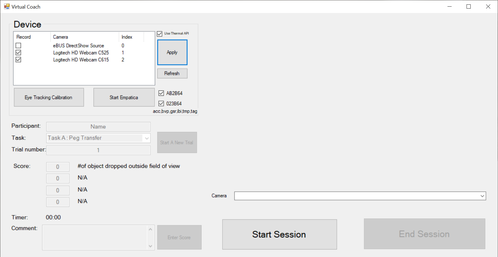

# Eyetracking

Program name:

 Virtual Coach\Release\TobiiTesting1.exe

Pre-installed:
- E4 stream (wifi) : acc,bvp,gsr,ibi,tmp,tag 
- TobiiProEyeTrackerManager

Setup:
1) Download and release "Virtual Coach.zip"
2) Double click "...\Virtual Coach\Release\TobiiTesting1.exe"

Notes:
The usb hub can only load one camera.

Screen shot:

Tobii SDK
refer to : http://developer.tobiipro.com/NET/dotnet-sdk-reference-guide.html

Empatica 
refer to:
1. E4 streaming server: https://developer.empatica.com/windows-streaming-server.html
2. Download: https://developer.empatica.com/windows-streaming-server-usage.html
3. Running server: https://developer.empatica.com/windows-streaming-server-usage.html#firmware-upgrade

